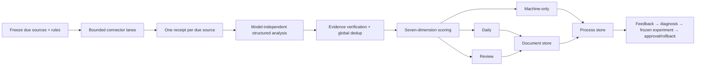

# Briefwright

<p align="center"><strong>English</strong> · <a href="./README.zh-CN.md">简体中文</a></p>

Briefwright turns monitored sources into an auditable Daily briefing, a human Review queue, and a governed improvement loop. It is the open-source form of a production AI-intelligence workflow: one receipt per due source, canonical evidence, global deduplication, seven-dimension scoring, valid empty outputs, immutable replay, and explicit human approval before knowledge or rule changes.

It is vendor-neutral:

| Layer | Recommended | Other supported choices | No-configuration behavior |
|---|---|---|---|
| AI model | Choose during setup | Local Codex account, OpenAI, Anthropic, Gemini, Qwen, Ollama, or a registered compatible provider | Fixture preview works without AI; real runs need the selected provider |
| Process data | Feishu Base through `lark-cli` | PostgreSQL, MySQL, SQLite | Explicit SQLite fallback |
| Documents | Obsidian Markdown vault | Normal local folder | Explicit local-folder fallback |
| Scheduling | Codex independent-task automation or native scheduler | launchd, cron, Windows Task Scheduler | Manual until enabled |

## Start here

Briefwright requires Node.js 22.13 or newer. The npm short-name release is intentionally deferred to
the next distribution version; `briefwright` is not yet published in the npm registry. For the
current v2.0.1 release, download the checksum-pinned tarball from
[GitHub Releases](https://github.com/RacYang/briefwright/releases/latest) and install the local file:

```bash
npm install -g ./briefwright-2.0.1.tgz
```

Do not use `npm install -g briefwright` until the registry release is announced. The next release is
intended to make that short command the primary path while retaining the tarball as an offline
fallback.

### Recommended: talk to the Skill

The managed installer below is available from the current source tree and will ship in the next
product release. The published v2.0.1 tarball already contains `skill/briefwright`, but does not yet
include this installer command.

Install the bundled conversational Skill once:

```bash
briefwright skill install --yes
```

Restart Codex and say:

> Create my first Briefwright briefing. Watch AI agents every day, recommend the storage choices, and explain each decision in plain language.

The Skill checks the installation, asks one small question at a time, lets you choose any supported model, connects Feishu/SQL and Obsidian/a local folder, creates a safe preview, explains failures, and asks before any schedule or remote write. You do not maintain YAML or memorize commands. The CLI stays underneath as the auditable execution engine; the Skill owns no parallel schema or state.

What happens next:

1. An offline fixture preview confirms installation and Markdown rendering. It does **not** use AI or claim that live sources work.
2. A local health check validates configuration, paths, and SQLite.
3. A live preview checks real sources without installing a schedule.
4. An online health check verifies the selected model and external stores.
5. A formal run creates Daily, Review, receipts, events, and the improvement evidence trail.
6. Scheduling is offered only after the live proof passes and you explicitly approve it.

### Alternative: use the terminal wizard

If you prefer a terminal, create an empty folder and run `briefwright setup`. The local wizard asks for the briefing topic, model, process-data store, document destination, and schedule intent, then shows the plan before writing anything. It does not require YAML knowledge and never installs a schedule during setup.

For maintainers building from source:

```bash
pnpm install
pnpm build
npm link
```

The offline demo needs no account or API key because it uses bundled fixture data. A formal briefing does use AI and requires the model you selected. A schedule requires a recent untampered live preview, a passing online doctor, and explicit confirmation.

## Choose any supported model

Briefwright never assumes Qwen. Setup detects common local environment variables and lets you choose:

| Provider | Default model preset | Local secret reference |
|---|---|---|
| Codex | `gpt-5.6-sol` | reuses the local Codex login; no separate API key |
| OpenAI | `gpt-5-mini` | `OPENAI_API_KEY` |
| Anthropic | `claude-sonnet-5` | `ANTHROPIC_API_KEY` |
| Google Gemini | `gemini-3.6-flash` | `GEMINI_API_KEY` |
| Alibaba Qwen | `qwen3.6-flash` | `DASHSCOPE_API_KEY` |
| Ollama | `qwen3:8b` at localhost | no key |

Provider presets use official APIs and can be overridden by a typed custom provider. Secrets are `env` or `file` references; plaintext values do not enter `briefing.yaml`, hashes, SQLite snapshots, JSON output, or errors. See [model providers](docs/providers.md).

## Feishu Base with `lark-cli`

Feishu is the recommended collaborative process-data store, not the only store. Briefwright delegates Feishu identity and authorization to the installed `lark-cli`; it does not embed another OAuth client.

In conversational mode, say “Use this Feishu Base for process data” and provide its link. The Skill
checks whether `lark-cli` is installed and signed in, extracts only the Base identifier it needs,
explains any missing login or permission, and asks before creating tables or synchronizing records.
It never asks an ordinary user for table IDs. The commands below are the operator equivalent:

```bash
lark-cli whoami
briefwright setup \
  --process-store lark \
  --lark-base YOUR_BASE_APP_TOKEN \
  --document-store obsidian \
  --document-root "/absolute/path/to/Your Vault"

briefwright lark provision --yes  # new Base: idempotently create missing standard tables, fields, and links
briefwright doctor --online
briefwright import lark
briefwright sync plan
briefwright sync apply --yes
```

The adapter discovers the nine standard Chinese table names for sources, runs, captures, receipts, items, events, feedback, experiments, and rules; it never uses another user's hard-coded table IDs. Existing deployments may override each name with their own ID. `lark provision --yes` idempotently fills missing tables, fields, and relationships without deleting, renaming, or overwriting existing data. Runtime reads are paginated, links resolve through stable business IDs, writes use a two-pass upsert, and partial synchronization remains visible. `doctor` uses a CLI dry run and does not create a record.

If Feishu is not selected, PostgreSQL and MySQL use the same canonical record contract. If nothing is configured, Briefwright says it is using local-only SQLite. See [process stores](docs/process-stores.md) and [Lark setup](docs/lark.md).

## Obsidian or a local folder

Obsidian is a document experience over Markdown, not a hidden database dependency. The Obsidian adapter writes only to the configured briefing root:

```text
Inbox/AI Intelligence/
├── Daily/YYYY-MM-DD-AI情报简报.md
├── Review/YYYY-MM-DD-AI情报待复核.md
├── Note-AI情报候选池.md
└── Note-AI情报待复核.md
```

The indexes use managed markers and Wiki-links. Empty Daily and Review files are still produced. Automatic runs cannot write evergreen notes. `knowledge propose` creates a preview; `knowledge commit --yes` verifies the target hash before the approved write. Without an Obsidian vault, the same artifacts go to a normal local folder. See [document stores](docs/document-stores.md).

## What a formal run does



The 14 observable stages are initialize, freeze due manifest, discover, capture, receipts, normalize, evidence verification, deduplication, score, select, publish, persist, integrity validation, and complete. Every explicit URL has a successful or failed capture record with available HTTP and parser metadata; protected source text is limited to a 25-word excerpt. The bounded completion report includes due/receipt/update/failure/missing counts, stage counts, p50/p95 source latency, capture throughput, failed source IDs, domains, top items, seven Rule IDs, and process/document validation.

Current source types include RSS, GitHub Releases, bounded webpages, the official X API v2, a Codex read-only browser bridge, and extension connectors. X remains clue-only: a post cannot pass the primary-evidence gate without its canonical first-party source. An independent Codex task may use `codex-browser`: the CLI emits only the currently due accounts, Codex reads public pages without interaction, and the CLI accepts only a schema-, account-, and status-URL-bound temporary bundle. Users can instead supply `X_BEARER_TOKEN` for the official API. Missing bundles, credentials, and capture failures produce explicit failed receipts. A bounded full source body may exist only in memory for the current analysis pass; SQLite, Base, snapshots, logs, and model-independent artifacts retain only metadata and the 25-word excerpt.

## Governed self-improvement

Intermediate data has a purpose. Briefwright accepts include, skip, review, compare, classification correction, score correction, source correction, process feedback, usage, and knowledge-worthiness signals.

An ordinary user can simply say “this item was useful”, “this source is repeatedly wrong”, or “show
me the improvement proposals”. The Skill records only that feedback, explains the evidence and
guardrails behind each proposal, and asks again before approval or activation. The commands below
are for operators and automation:

```bash
briefwright feedback add AI-... --type used --note "Changed a decision"
briefwright improve diagnose --window 30
briefwright improve list
briefwright experiment create --candidate candidate-policy.json
briefwright experiment evaluate EXP-...
briefwright experiment approve EXP-... --yes
briefwright experiment activate EXP-... --yes
briefwright experiment rollback EXP-... --yes
```

Formal runs invoke the diagnosis evaluator at most once every seven days over a 30-day window. Intermediate records can therefore create non-active source-reliability, policy/prompt, provider/model-contract, deduplication, and output/selection proposals; none is activated automatically. Policy experiments freeze at least 14 days and 50 reviewed items, replay baseline and candidate, and compare positive retention, negative selection, primary-evidence compliance, coverage, and selection deltas. A sufficiently large but harmful or merely unchanged candidate cannot be approved. Humans own approval and activation; rollback remains digest-bound. See [self-improvement](docs/self-improvement.md).

## Scheduling like the production workflow

In conversational mode, ask “run this every weekday at 9”. The Skill first explains the exact
schedule and required live checks; it cannot enable anything until the current configuration has a
valid live preview, online doctor, and your explicit confirmation.

Codex users can export an independent-task definition matching the existing automation boundary:

```bash
briefwright schedule codex
```

It freezes the config file, current CLI, packaged execution protocol, and optional source-system contract digests. It conditionally prepares the current X browser manifest, runs online doctor, then performs the formal run through absolute executable paths. The configured Lark/SQL control plane and Obsidian/local document store remain authoritative, and only the bounded completion report is returned. It does not install anything.

Production export should come from a released package in a versioned runtime directory, not a
mutable Git checkout. The definition exposes that condition as `runtime.immutable` and warns before
cutover; upgrades create a new runtime directory and require an explicit automation update.

For an existing Codex automation, do not hand-copy sources or table mappings. Follow the read-only import, live preview, isolated shadow run, and digest-bound cutover in [Migrating an existing Codex automation](docs/migration-from-codex-automation.md).

Native scheduling is also supported:

```bash
briefwright schedule describe
briefwright schedule enable --yes
briefwright schedule status
briefwright schedule disable --yes
```

## Commands

| Command | Purpose |
|---|---|
| `skill install`, `skill status` | Managed conversational Skill installation and read-only integrity status |
| `setup`, `init`, `demo` | Guided project, minimal project, offline demonstration |
| `preview [--live]`, `run [--retry-failed]` | Local-only preview and formal/recovery pipeline |
| `doctor [--online] [--all-sources]`, `status`, `open`, `replay` | Due-source/full diagnostics, inspect, open, and verify |
| `capture manifest`, `capture validate` | Manifest and bundle checks for Codex read-only browser captures |
| `import lark`, `import contract` | Versioned read-only import snapshots |
| `lark provision --yes`, `sql provision --yes` | Explicitly initialize the selected remote process-store schema |
| `sync plan`, `sync apply --yes` | Review and apply process-store synchronization |
| `config ...`, `db migrate` | Explainable configuration and separate migrations |
| `feedback ...`, `improve ...`, `experiment ...`, `cadence ...` | Governed learning loop |
| `knowledge propose`, `knowledge commit --yes` | Human-confirmed Markdown knowledge writes |
| `schedule codex`, `schedule ...` | Independent-task export or native scheduling |
| `capabilities` | Machine-readable feature surface |

Add global `--json` for bounded machine-readable output. The packaged Codex Skill calls the same CLI and owns no parallel schema or state.

## Trust boundaries

- Source text is untrusted evidence, never model instructions.
- Connector hosts are allowlisted; DNS results and private/loopback addresses are checked.
- Provider endpoints are typed and host-bound; localhost HTTP is allowed only when explicitly declared.
- Paths are canonicalized and symlink escapes are rejected.
- Same-day formal runs are idempotent; recovery creates a linked immutable run.
- Secrets are redacted; external writes require explicit configuration or confirmation.
- No item is padded into Daily or Review, and failures never become facts.

Read [operations](docs/operations.md), the [threat model](docs/threat-model.md), and [security policy](SECURITY.md). Contributions are welcome under [Apache-2.0](LICENSE); see [CONTRIBUTING.md](CONTRIBUTING.md).
