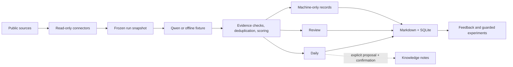

# Briefwright

<p align="center">
  <strong>English</strong> · <a href="./README.zh-CN.md">简体中文</a>
</p>

<p align="center">
  <a href="https://github.com/RacYang/briefwright/releases/latest"></a>
  <a href="https://github.com/RacYang/briefwright/actions/workflows/ci.yml"></a>
  <a href="./LICENSE"></a>
  
</p>

Briefwright is a local-first briefing builder that turns public sources into calm, source-linked AI
intelligence. It gives new users one small intent file while preserving the receipts, evidence
gates, policy versions, failures, and replay data needed to trust a recurring briefing.

**Simple at the surface, rigorous underneath:**

- start offline in two minutes, without an account or API key;
- configure interests, schedule, and output in one short YAML file;
- keep credentials on your machine and bring your own Qwen key for real runs;
- trace every selected item back to evidence and every due source to a receipt;
- preview schedules and knowledge changes before anything writes outside the run.

## Quick start

### Install the stable release

Requirements: Node.js 22.13 or newer on macOS, Linux, or Windows.

```bash
npm install -g https://github.com/RacYang/briefwright/releases/download/v1.0.0/briefwright-1.0.0.tgz
briefwright demo
```

`demo` is deterministic and offline. It creates an example briefing without installing a schedule,
calling a model, or writing to a knowledge base.

To create your own briefing:

```bash
mkdir my-briefing && cd my-briefing
briefwright init
briefwright preview
```

The generated `briefing.yaml` is the ordinary user interface:

```yaml
version: 2
name: My AI briefing
preset: ai-daily
interests:
  - AI agents
  - model releases
  - AI safety
schedule: manual
output: markdown
outputDirectory: briefs
ai: qwen
```

The default preview uses bundled fixtures, so it also needs no credential or network access.

<details>
<summary>Install from source</summary>

```bash
git clone https://github.com/RacYang/briefwright.git
cd briefwright
pnpm install
pnpm build
node dist/cli.js demo
```

</details>

<details>
<summary>Verify the release artifact</summary>

Briefwright publishes GitHub artifact attestations. With the GitHub CLI installed:

```bash
gh release download v1.0.0 --repo RacYang/briefwright --pattern 'briefwright-1.0.0.tgz'
gh attestation verify briefwright-1.0.0.tgz --repo RacYang/briefwright
```

</details>

## What you get

```text
my-briefing/
├── briefing.yaml              # the file most users edit
├── .env.local                 # optional local credential, ignored by Git
├── .briefwright/state.db      # local run, receipt, feedback, and audit state
└── briefs/
    ├── Daily/                 # high-confidence selected items
    └── Review/                # promising items that need human review
```

| Concern | Briefwright's behavior |
|---|---|
| Setup | One intent file; advanced resources stay hidden until ejected |
| Collection | Incremental, bounded connectors with one receipt per due source |
| Evidence | Primary evidence and claim support are required for selection |
| Selection | Deterministic scoring, thresholds, diversity caps, and valid empty output |
| Failures | Partial and failed outcomes stay visible; errors do not become facts |
| State | Local SQLite snapshots plus readable Markdown artifacts |
| Automation | Native schedules require a fresh live preview and explicit confirmation |
| Knowledge | Proposals are previewed; commits require human confirmation and target-hash checks |

## How it works



A run freezes the effective configuration, source manifest, policy, and prompt versions. It then
collects only due sources, records exactly one receipt for each, validates structured model output,
checks claim support, deduplicates, scores, selects, and persists an immutable audit snapshot.
Rendering and replay are deterministic and offline.

## Run a real briefing with Qwen

Briefwright is bring-your-own-key. Put a test or production key in an ignored local file—never in
`briefing.yaml`:

```bash
cp .env.example .env.local
# Edit .env.local and set DASHSCOPE_API_KEY

briefwright doctor --online
briefwright run
briefwright status
briefwright open
```

Alibaba Model Studio keys and endpoints are region and workspace specific. Briefwright accepts the
pay-as-you-go and trial OpenAI-compatible endpoints for Beijing, Singapore, Virginia, Tokyo, and
Frankfurt, including workspace-dedicated domains. Coding Plan and Token Plan keys are rejected
because those plans target interactive coding tools rather than recurring backend jobs. If online
preflight reports model access denied, see [configuration](docs/configuration.md) for regional model
and endpoint settings.

## Scheduling

Set `schedule` in `briefing.yaml` to `daily-at-10` or `weekdays-at-09`. Briefwright supports launchd
on macOS, user cron on Linux, and Task Scheduler on Windows.

Before enabling a schedule, it requires a successful, untampered live preview of the current
configuration from the last seven days and a passing online preflight:

```bash
briefwright preview --live
briefwright doctor --online
briefwright schedule describe
briefwright schedule enable --yes
```

`schedule: manual` is rejected instead of installing a no-op task. Run
`briefwright schedule disable --yes` to remove a schedule created by Briefwright.

## Trust and governance

- Daily requires a score of at least 70. Review accepts 60–69 only when the stable-knowledge gate
  also passes.
- Daily contains at most 12 items and three per domain. A truthful empty artifact is valid.
- Unsupported model claims are excluded rather than promoted.
- Same-day formal runs are idempotent; interrupted finalization is resumable.
- `run --retry-failed` creates a linked immutable recovery run instead of rewriting history.
- `replay` regenerates recorded artifacts offline and checks both snapshot and current-file hashes.
- Feedback cannot change policy directly. Experiments need enough reviewed evidence, explicit
  approval, activation, and a rollback path.
- Source cadence changes follow the same propose, review, approve, or reject boundary.
- Knowledge changes are previewed proposals. A commit is refused if the target changed after preview.

For the detailed boundaries, read the [threat model](docs/threat-model.md) and
[security policy](SECURITY.md).

## Commands

| Command | Purpose |
|---|---|
| `demo` | Offline, credential-free demonstration |
| `init` | Create one intent file without enabling anything |
| `preview [--live]` | Fixture preview or read-only public-source preview |
| `run [--retry-failed]` | Formal incremental pipeline or linked immutable recovery run |
| `status`, `open`, `replay` | Inspect and verify durable runs |
| `config validate\|render\|explain\|diff\|migrate\|eject` | Typed configuration lifecycle |
| `db migrate` | Preview or explicitly apply SQLite migrations |
| `doctor [--online]` | Offline correctness or online provider and source checks |
| `schedule describe\|enable\|disable\|status` | Native scheduling with confirmation |
| `feedback add\|summary` | Record human outcome signals |
| `experiment create\|evaluate\|approve\|activate\|rollback` | Guarded policy improvement |
| `cadence evaluate\|list\|approve\|reject\|lock` | Guarded source-frequency governance |
| `knowledge propose\|commit` | Human-confirmed Markdown or Obsidian integration |
| `capabilities` | Machine-readable installed feature surface |

Add global `--json` for stable, bounded machine-readable output. The packaged Codex Skill uses this
surface and owns no separate schema, policy, or durable state.

## Advanced configuration and connectors

Most people never need this section. When the intent file cannot express a requirement:

```bash
briefwright config eject --yes
briefwright config validate
briefwright config explain provider
```

This creates versioned `Profile`, `PolicyBundle`, `PromptPack`, `Output`, and per-source resources in
`briefwright.d/`. Unknown fields, unsafe provider endpoints, invalid score weights, broken cadence
bounds, and unknown source references fail validation. Secrets remain references, not mergeable
configuration values.

Briefwright ships GitHub Releases and RSS connectors. Extensions use the exported connector SDK and
must declare capabilities, allowed hosts, configuration schema, timeouts, and bounded response
behavior. See [configuration](docs/configuration.md) and the [connector contract](docs/connectors.md).

## Scope and non-goals

Briefwright v1 is a self-hosted CLI and Codex Skill, not a hosted feed reader or a managed SaaS.
It intentionally does not:

- store API keys in project configuration or provide a secret-management service;
- turn model output into confirmed facts without evidence checks;
- hide source failures or fabricate items to fill a quota;
- silently enable operating-system schedules;
- automatically rewrite a knowledge base without an approved proposal.

The bundled `ai-daily` preset is a useful starting point, not a claim of complete coverage. Add or
eject sources when your domain requires a different evidence universe.

## Documentation

| Guide | What it covers |
|---|---|
| [Configuration](docs/configuration.md) | Intent file, effective config, secrets, migrations, provider regions |
| [Operations](docs/operations.md) | Runs, recovery, scheduling, replay, retention, backup |
| [Connectors](docs/connectors.md) | Connector SDK, descriptors, network and acceptance contract |
| [Threat model](docs/threat-model.md) | Trust boundaries, mitigations, and residual risks |
| [Product experience RFC](docs/rfcs/0001-product-experience.md) | Progressive disclosure and user journey |
| [Configuration RFC](docs/rfcs/0002-configuration.md) | Typed layered configuration design |
| [Runtime architecture RFC](docs/rfcs/0003-architecture.md) | State machine, evidence, persistence, and concurrency |
| [Delivery matrix](docs/implementation/complete-system-matrix.md) | Implemented system surface and acceptance evidence |
| [Changelog](CHANGELOG.md) | Release history |

## Contributing and security

Focused issues and pull requests are welcome. Please read [CONTRIBUTING.md](CONTRIBUTING.md) before
large changes and follow the [Code of Conduct](CODE_OF_CONDUCT.md). Report vulnerabilities privately
as described in [SECURITY.md](SECURITY.md), not in a public issue.

Licensed under [Apache-2.0](LICENSE).
