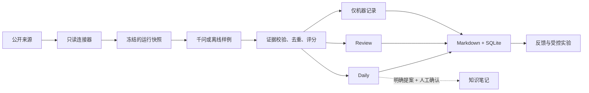

# Briefwright

<p align="center">
  <a href="./README.md">English</a> · <strong>简体中文</strong>
</p>

<p align="center">
  <a href="https://github.com/RacYang/briefwright/releases/latest"></a>
  <a href="https://github.com/RacYang/briefwright/actions/workflows/ci.yml"></a>
  <a href="./LICENSE"></a>
  
</p>

Briefwright 是一个本地优先的简报构建器，将公开来源转化为克制、可追溯的 AI 情报简报。
新用户只需维护一份简短的意图配置，同时仍然保留周期性简报值得信任所需的回执、证据门、
规则版本、失败记录与重放数据。

**表面简单，底层严谨：**

- 两分钟离线开始，无需账户或 API Key；
- 在一份简短的 YAML 中配置兴趣、计划与输出；
- 凭证只留在本机，真实运行时接入你自己的千问 Key；
- 每条入选情报都能回溯到证据，每个到期来源都有回执；
- 计划任务和知识库变更都先预览，再由用户明确确认。

## 快速开始

### 安装稳定版

环境要求：macOS、Linux 或 Windows，Node.js 22.13 或更高版本。

```bash
npm install -g https://github.com/RacYang/briefwright/releases/download/v1.0.0/briefwright-1.0.0.tgz
briefwright demo
```

`demo` 是确定性、纯离线的演示。它会生成一份示例简报，但不会安装计划任务、调用模型或写入知识库。

创建你自己的简报：

```bash
mkdir my-briefing && cd my-briefing
briefwright init
briefwright preview
```

生成的 `briefing.yaml` 就是普通用户主要使用的界面：

```yaml
version: 2
name: My AI briefing
preset: ai-daily
interests:
  - AI agents
  - model releases
  - AI safety
schedule: manual
output: markdown
outputDirectory: briefs
ai: qwen
```

默认预览使用项目内置的固定样例，同样不需要凭证或网络。

<details>
<summary>从源码安装</summary>

```bash
git clone https://github.com/RacYang/briefwright.git
cd briefwright
pnpm install
pnpm build
node dist/cli.js demo
```

</details>

<details>
<summary>验证发行包来源</summary>

Briefwright 会为 GitHub 发行包发布构建来源证明。安装 GitHub CLI 后可执行：

```bash
gh release download v1.0.0 --repo RacYang/briefwright --pattern 'briefwright-1.0.0.tgz'
gh attestation verify briefwright-1.0.0.tgz --repo RacYang/briefwright
```

</details>

## 你会得到什么

```text
my-briefing/
├── briefing.yaml              # 大多数用户唯一需要编辑的文件
├── .env.local                 # 可选的本地凭证文件，Git 默认忽略
├── .briefwright/state.db      # 本地运行、回执、反馈与审计状态
└── briefs/
    ├── Daily/                 # 高置信度入选条目
    └── Review/                # 有潜力但需要人工复核的条目
```

| 关注点 | Briefwright 的处理方式 |
|---|---|
| 上手配置 | 一份意图文件；只有主动 eject 后才显示高级资源 |
| 信息采集 | 有边界的增量连接器；每个到期来源恰好一条回执 |
| 证据 | 入选必须具备一手证据与主张支持关系 |
| 筛选 | 确定性评分、阈值、领域上限，并允许诚实的空结果 |
| 失败 | 部分成功和失败保持可见，错误不会变成事实 |
| 状态 | 本地 SQLite 快照 + 人类可读 Markdown 产物 |
| 自动化 | 必须先有近期真实预览并明确确认，才能安装原生计划任务 |
| 知识库 | 先生成提案；人工确认且目标哈希未变化时才提交 |

## 工作原理



每次运行都会冻结有效配置、来源清单、规则和提示词版本，然后只采集到期来源，为每个来源记录
唯一回执，校验结构化模型输出与主张证据，完成去重、评分、筛选，最后持久化不可变的审计快照。
渲染和重放都是确定性的离线过程。

## 使用千问生成真实简报

Briefwright 采用 BYOK（自带 Key）模式。请把测试或生产 Key 放在被忽略的本地文件里，绝不要写入
`briefing.yaml`：

```bash
cp .env.example .env.local
# 编辑 .env.local，设置 DASHSCOPE_API_KEY

briefwright doctor --online
briefwright run
briefwright status
briefwright open
```

阿里云百炼的 Key 和端点与地域、工作空间有关。Briefwright 支持北京、新加坡、弗吉尼亚、东京、
法兰克福的按量付费及试用 OpenAI 兼容端点，也支持工作空间专属域名。Coding Plan 和 Token Plan
面向交互式编程工具，因此会被拒绝用于周期性后台任务。如果在线预检提示无模型权限，请参考
[配置文档](docs/configuration.md)调整地域对应的模型和端点。

## 计划任务

把 `briefing.yaml` 中的 `schedule` 设置为 `daily-at-10` 或 `weekdays-at-09`。Briefwright 在 macOS
使用 launchd，在 Linux 使用用户 cron，在 Windows 使用任务计划程序。

启用前，当前配置必须在最近七天内完成一次未被篡改的真实预览，并通过在线预检：

```bash
briefwright preview --live
briefwright doctor --online
briefwright schedule describe
briefwright schedule enable --yes
```

当配置为 `schedule: manual` 时，系统会拒绝安装无效任务。执行
`briefwright schedule disable --yes` 可移除 Briefwright 创建的计划任务。

## 可信与治理机制

- Daily 评分至少为 70；Review 仅接收 60–69 且通过稳定知识潜力门的条目。
- Daily 最多 12 条、每个领域最多 3 条；诚实的空简报也是合法结果。
- 没有证据支持的模型主张会被排除，而不是被包装成事实。
- 同日正式运行具有幂等性；被中断的最终写入可以恢复。
- `run --retry-failed` 会创建有链接、不可变的恢复运行，不会重写历史。
- `replay` 可离线重新生成产物，并同时核验快照哈希与当前磁盘文件。
- 反馈不能直接修改规则；实验必须积累足够复核证据，并经过批准、激活且具备回滚路径。
- 来源频率调整同样遵循提案、复核、批准或拒绝的边界。
- 知识变更先生成预览提案；如果目标文件在预览后发生变化，提交会被拒绝。

更完整的边界见[威胁模型](docs/threat-model.md)与[安全策略](SECURITY.md)。

## 命令一览

| 命令 | 用途 |
|---|---|
| `demo` | 离线、无需凭证的演示 |
| `init` | 创建意图文件，不启用任何外部行为 |
| `preview [--live]` | 固定样例预览或公开来源只读预览 |
| `run [--retry-failed]` | 正式增量流水线或有链接的不可变恢复运行 |
| `status`、`open`、`replay` | 检查并验证持久化运行 |
| `config validate\|render\|explain\|diff\|migrate\|eject` | 类型化配置生命周期 |
| `db migrate` | 预览或明确执行 SQLite 迁移 |
| `doctor [--online]` | 离线正确性检查或在线模型与来源检查 |
| `schedule describe\|enable\|disable\|status` | 带确认机制的原生计划任务 |
| `feedback add\|summary` | 记录人工结果信号 |
| `experiment create\|evaluate\|approve\|activate\|rollback` | 受控规则改进 |
| `cadence evaluate\|list\|approve\|reject\|lock` | 受控来源频率治理 |
| `knowledge propose\|commit` | 人工确认的 Markdown 或 Obsidian 集成 |
| `capabilities` | 机器可读的已安装能力列表 |

所有命令都可添加全局参数 `--json`，获得稳定、有边界的机器可读输出。项目自带的 Codex Skill
使用这一接口，自身不维护另一套 schema、规则或持久化状态。

## 高级配置与连接器

大多数用户永远不需要这一节。当意图文件无法表达某项需求时：

```bash
briefwright config eject --yes
briefwright config validate
briefwright config explain provider
```

这会在 `briefwright.d/` 中创建带版本的 `Profile`、`PolicyBundle`、`PromptPack`、`Output` 和
单来源资源。未知字段、不安全的模型端点、无效评分权重、错误频率边界和未知来源引用都会校验失败。
凭证始终是引用，不会成为可合并的普通配置值。

Briefwright 内置 GitHub Releases 和 RSS 连接器。扩展连接器使用导出的 SDK，并且必须声明能力、
允许访问的主机、配置 schema、超时与响应大小边界。详见[配置文档](docs/configuration.md)与
[连接器契约](docs/connectors.md)。

## 范围与非目标

Briefwright v1 是自托管 CLI 与 Codex Skill，不是托管式阅读器或 SaaS。它有意不做以下事情：

- 在项目配置中保存 API Key，或充当密钥管理服务；
- 在没有证据校验的情况下把模型输出当作确认事实；
- 隐藏来源失败，或为了凑数而生成条目；
- 静默安装操作系统计划任务；
- 在没有批准提案的情况下自动改写知识库。

内置的 `ai-daily` preset 是一个实用起点，不代表已经完整覆盖所有 AI 信息源。当你的领域需要
不同的证据范围时，请添加来源或 eject 高级配置。

## 文档导航

| 文档 | 内容 |
|---|---|
| [配置](docs/configuration.md) | 意图文件、有效配置、凭证、迁移与模型地域 |
| [运维](docs/operations.md) | 运行、恢复、计划任务、重放、保留与备份 |
| [连接器](docs/connectors.md) | 连接器 SDK、描述文件、网络与验收契约 |
| [威胁模型](docs/threat-model.md) | 信任边界、缓解措施与遗留风险 |
| [产品体验 RFC](docs/rfcs/0001-product-experience.md) | 渐进式披露与用户旅程 |
| [配置 RFC](docs/rfcs/0002-configuration.md) | 类型化分层配置设计 |
| [运行时架构 RFC](docs/rfcs/0003-architecture.md) | 状态机、证据、持久化与并发 |
| [交付矩阵](docs/implementation/complete-system-matrix.md) | 已实现系统边界与验收证据 |
| [更新日志](CHANGELOG.md) | 版本历史 |

## 参与贡献与安全报告

欢迎提交聚焦的问题与 Pull Request。大型改动前请先阅读 [CONTRIBUTING.md](CONTRIBUTING.md)，
并遵守[行为准则](CODE_OF_CONDUCT.md)。安全漏洞请按照 [SECURITY.md](SECURITY.md) 私下报告，
不要在公开 Issue 中披露。

项目采用 [Apache-2.0](LICENSE) 许可证。
