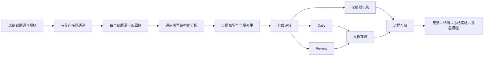

# Briefwright

<p align="center"><a href="./README.md">English</a> · <strong>简体中文</strong></p>

Briefwright 把持续监控的来源转化为可审计的 Daily 简报、人工 Review 队列和受治理的自我迭代闭环。它不是一个“让模型总结几个链接”的脚本，而是现有 AI 情报生产体系的开源通用实现：每个到期来源恰好一条回执、canonical 证据、全局去重、七维评分、允许诚实的空结果、不可变重放，以及知识或规则变更前的人工批准。

它不绑定任何单一厂商：

| 层 | 推荐方式 | 其他已支持方式 | 未配置时 |
|---|---|---|---|
| AI 模型 | 在 setup 中自行选择 | Codex 本机账户、OpenAI、Anthropic、Gemini、千问、Ollama、自注册兼容 Provider | 离线预览不调用 AI；真实运行使用所选模型 |
| 过程数据 | 通过 `lark-cli` 接入飞书 Base | PostgreSQL、MySQL、SQLite | 明确降级为 SQLite |
| 文档 | Obsidian Markdown vault | 普通本地文件夹 | 明确降级为本地文件夹 |
| 定时任务 | Codex 独立任务或系统原生调度 | launchd、cron、Windows 任务计划 | 默认手动，不会静默启用 |

## 普通用户从这里开始

环境要求：Node.js 22.13 或更高版本。可以从 GitHub Release 下载 `briefwright-2.0.1.tgz` 后安装，也可以从源码构建：

```bash
npm install -g ./briefwright-2.0.1.tgz
```

源码方式：

```bash
pnpm install
pnpm build
npm link

mkdir my-briefing && cd my-briefing
briefwright setup
```

`setup` 只问五件事：简报主题、使用哪个模型、过程数据放哪里、文档放哪里、是否设置周期。它会替你生成 `briefing.yaml`，普通用户不需要先学 YAML 或内部 schema。

如果你在 Codex 中使用本项目，也可以把 `skill/briefwright` 安装为 Skill，直接说“帮我创建一个每天的 AI 简报，过程数据放飞书，文档放 Obsidian”。Skill 会代你调用同一套 CLI；你不需要记命令，也不会产生第二套规则或状态。CLI 是可审计执行层，不是对普通用户的知识门槛。

随后按安全顺序操作：

```bash
briefwright preview                 # 离线样例，只证明渲染链路
briefwright doctor                  # 本地配置、路径和数据库检查
briefwright preview --live          # 真实采集来源，但不安装定时任务
briefwright doctor --online         # 模型、过程存储、来源在线检查
briefwright run                     # 真正调用 AI 的正式简报
briefwright open
```

`preview` 是纯离线固定样例，不会调用 AI；它只用于让用户在两分钟内看见产物并确认输出位置。`run` 才是真实 AI 流水线，需要用户所选 Provider 可用。

setup 不会安装定时任务。必须先有近期未被篡改的 live preview、在线 doctor 通过，并由用户明确确认，才能启用周期运行。

## 模型由用户决定

Briefwright 不默认“只能用千问”。setup 会检测常见环境变量并让用户选择：

| Provider | 内置默认模型 | 本机凭证引用 |
|---|---|---|
| Codex | `gpt-5.6-sol` | 使用本机 Codex 登录，不另存 API Key |
| OpenAI | `gpt-5-mini` | `OPENAI_API_KEY` |
| Anthropic | `claude-sonnet-5` | `ANTHROPIC_API_KEY` |
| Google Gemini | `gemini-3.6-flash` | `GEMINI_API_KEY` |
| 阿里云千问 | `qwen3.6-flash` | `DASHSCOPE_API_KEY` |
| Ollama | 本机 `qwen3:8b` | 不需要 Key |

内置预设使用各厂商官方接口，也可通过类型化配置覆盖模型、端点或注册兼容 Provider。凭证只以 `env` 或 `file` 引用存在；明文不会进入 `briefing.yaml`、配置哈希、SQLite 快照、JSON 输出或错误信息。详见[模型接入](docs/providers.md)。

## 飞书 Base：默认推荐，但不是强依赖

飞书适合作为团队协作的过程数据控制面。Briefwright 只通过 `lark-cli` 使用飞书身份与授权，不再嵌入另一套 OAuth 或飞书 SDK。

```bash
lark-cli whoami
briefwright setup \
  --process-store lark \
  --lark-base YOUR_BASE_APP_TOKEN \
  --document-store obsidian \
  --document-root "/你的/Obsidian Vault/绝对路径"

briefwright lark provision --yes  # 新 Base：幂等创建缺少的 9 张标准表、字段和关联
briefwright doctor --online
briefwright import lark
briefwright sync plan
briefwright sync apply --yes
```

适配器理解现有九张表：数据源、运行批次、原始采集、扫描回执、情报条目、状态事件、人工反馈、优化实验、规则版本。默认按这些标准表名自动发现，因此不会使用其他人的硬编码 table ID；已有部署仍可逐表指定 ID。新 Base 用 `lark provision --yes` 幂等补齐缺少的表、字段和关联，它不删除、不改名，也不覆盖已有数据。随后适配器会分页读取、校验真实字段、按稳定业务 ID 解析关联、两阶段幂等 upsert，并把部分同步失败明确返回。`doctor` 的写入检查使用 dry-run，不会创建记录。

不使用飞书时可选 PostgreSQL 或 MySQL，它们遵循同一个 canonical 记录合同；什么都不配置时，系统会明确说明当前是 SQLite 本地模式。详见[过程存储](docs/process-stores.md)与[飞书接入](docs/lark.md)。

## Obsidian 或普通本地文件夹

Obsidian 是 Markdown 文档体验，不是隐藏的数据库依赖。Obsidian 适配器只写配置允许的简报路径：

```text
Inbox/AI Intelligence/
├── Daily/YYYY-MM-DD-AI情报简报.md
├── Review/YYYY-MM-DD-AI情报待复核.md
├── Note-AI情报候选池.md
└── Note-AI情报待复核.md
```

索引使用受管 marker 与 Wiki-link；即使零条也会生成 Daily 和 Review。自动任务不能直接写常青知识笔记。`knowledge propose` 只生成预览；`knowledge commit --yes` 会再次核对目标哈希后才执行用户批准的写入。没有 Obsidian 时，相同 Markdown 会写入普通本地文件夹。详见[文档存储](docs/document-stores.md)。

## 正式流水线



可观察的 14 个阶段是：初始化、冻结到期清单、发现、抓取、回执、标准化、证据核验、全局去重、评分、筛选、发布、持久化、完整性校验、完成。每个明确 URL 都会留下成功或失败的采集记录与可得的 HTTP、解析器元数据；受版权保护的正文最多留存 25 个原文词。最终有界 completion report 包含到期/回执/更新/失败/缺失、各阶段数量与耗时、来源延迟 p50/p95、采集吞吐、失败 Source ID、领域、最高优先级条目、七条 Rule ID，以及过程存储和文档存储校验结果。

当前内置 RSS、GitHub Releases、受限网页、官方 X API v2、Codex 浏览器只读采集桥与扩展连接器。X 始终只作线索；没有 canonical 一手来源时，X 帖子不能通过一手证据门。普通独立任务可选择 `codex-browser`：先由 CLI 生成当次到期账号清单，Codex 只读浏览公开页面并交回有 schema、账号与状态 URL 绑定的临时 bundle，再由 CLI 校验后入流水线；也可改用用户自己的 `X_BEARER_TOKEN` 调官方 API。缺 bundle、缺凭证或采集失败都会产生明确失败回执。受限的完整来源正文只允许在本次分析的内存中短暂存在；SQLite、飞书 Base、快照、日志和模型无关产物只保留元数据与 25 词摘录。

## 自我迭代不是一句口号

中间数据会实际进入改进闭环。系统支持纳入、略过、复核、比较、分类纠正、评分纠正、来源纠正、流程反馈，以及 used、knowledge-worthy 等结果信号。

```bash
briefwright feedback add AI-... --type used --note "改变了一个实现决策"
briefwright improve diagnose --window 30
briefwright improve list
briefwright experiment create --candidate candidate-policy.json
briefwright experiment evaluate EXP-...
briefwright experiment approve EXP-... --yes
briefwright experiment activate EXP-... --yes
briefwright experiment rollback EXP-... --yes
```

正式运行每 7 天至多自动执行一次 30 天窗口诊断；中间数据会产生来源可靠性、策略/提示词、模型契约、去重和输出选择提案，但不会自动激活。策略实验至少冻结 14 天、50 条人工复核样本，回放基线与候选，并比较正向信号保留、负向条目误选、一手证据合规、覆盖与筛选变化。样本够大但效果变差、破坏护栏或没有真实改进的候选都不能批准。批准和激活始终属于人，回滚与 digest 绑定。详见[自我迭代](docs/self-improvement.md)。

## 同步现有定时任务边界

Codex 用户可以导出与现有体系一致的“独立任务”定义：

```bash
briefwright schedule codex
```

定义会冻结配置文件、当前 CLI、随版本发布的唯一执行协议，以及可选的原系统合同四个 digest。任务先生成当次 X 浏览器清单（如适用），再执行在线 doctor，最后运行正式简报；使用绝对可执行路径，不要求任务环境预先配置 `briefwright` 命令。它会继续使用已配置的 Lark/SQL 控制面与 Obsidian/本地文档存储，并只返回有界 completion report。这个命令只导出，不会静默安装。

已有 Codex 定时任务迁移时，不要手工复制 170 个来源或九张表。使用只读导入、live preview、shadow run 和 digest 绑定完成切换，步骤见[从现有 Codex 定时任务迁移](docs/migration-from-codex-automation.md)。

也可以使用系统原生调度：

```bash
briefwright schedule describe
briefwright schedule enable --yes
briefwright schedule status
briefwright schedule disable --yes
```

## 主要命令

| 命令 | 用途 |
|---|---|
| `setup`、`init`、`demo` | 引导式项目、最小项目、离线演示 |
| `preview [--live]`、`run [--retry-failed]` | 只写本地预览、正式或恢复运行 |
| `doctor [--online] [--all-sources]`、`status`、`open`、`replay` | 到期源/全量校验、检查、打开与重放 |
| `capture manifest`、`capture validate` | Codex 浏览器只读采集的清单与 bundle 校验 |
| `import lark`、`import contract` | 只读、版本化导入快照 |
| `lark provision --yes`、`sql provision --yes` | 显式初始化所选远程过程存储的 schema |
| `sync plan`、`sync apply --yes` | 预览并执行过程存储同步 |
| `config ...`、`db migrate` | 可解释配置与独立迁移 |
| `feedback ...`、`improve ...`、`experiment ...`、`cadence ...` | 受治理的改进闭环 |
| `knowledge propose`、`knowledge commit --yes` | 人工确认的 Markdown 知识写入 |
| `schedule codex`、`schedule ...` | 独立任务定义或系统原生调度 |
| `capabilities` | 机器可读能力表 |

所有命令都支持全局 `--json`，输出稳定、有边界的机器数据。项目附带的 Codex Skill 只调用同一 CLI，不维护第二套 schema、规则或状态。

## 信任边界

- 来源正文是“不可信证据”，不是模型指令。
- 连接器主机必须声明；DNS 解析结果与内网、回环地址都会检查。
- Provider 端点有类型与主机绑定；只有显式配置时才允许 localhost HTTP。
- 路径会做 canonical 与 symlink 逃逸检查。
- 同日正式运行幂等；恢复运行会创建有链接的不可变批次。
- 凭证始终脱敏；外部写入必须已配置或明确确认。
- 不为了凑数把条目塞进 Daily/Review，失败也不会变成事实。

进一步阅读：[运维](docs/operations.md)、[威胁模型](docs/threat-model.md)、[安全策略](SECURITY.md)。项目使用 [Apache-2.0](LICENSE)，贡献说明见 [CONTRIBUTING.md](CONTRIBUTING.md)。
